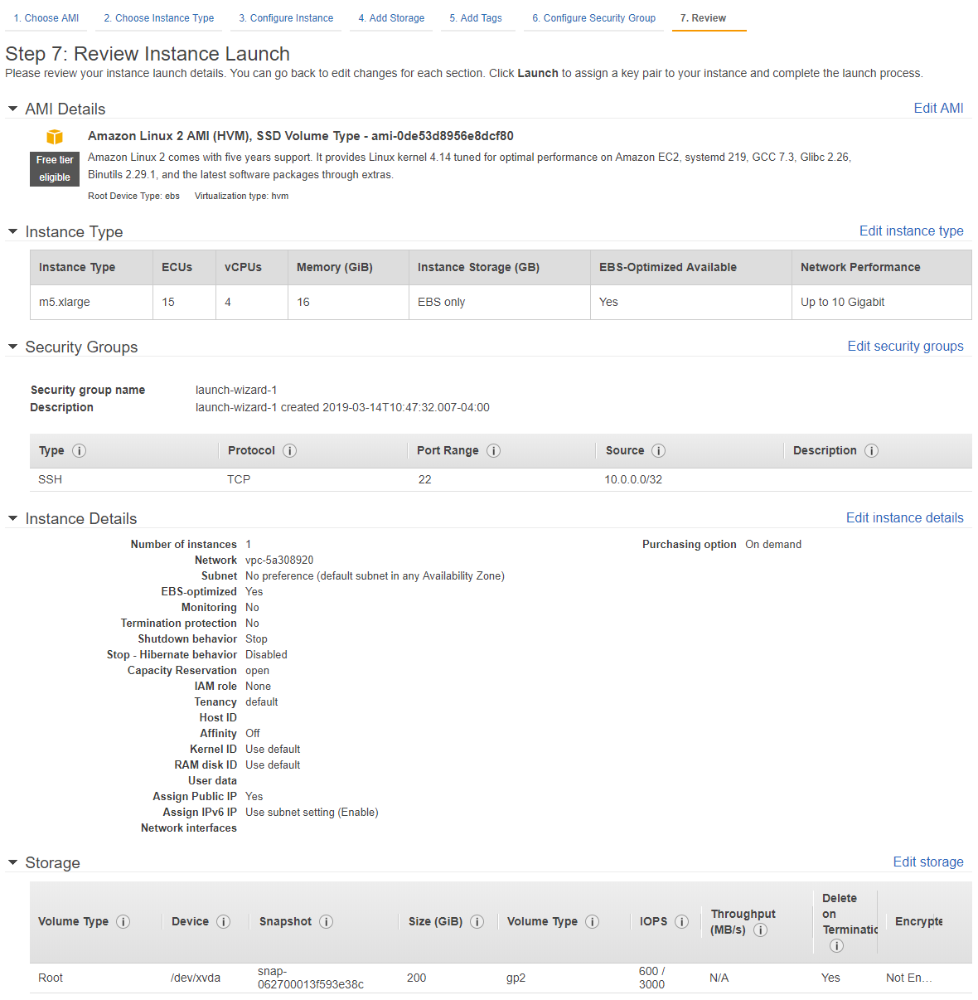

# DAS E2E Release

This is the demonstration release of the US Census Bureau's Disclosure
Avoidance System for the 2018 Census End-to-End test (E2E).

This release contains the actual code that was used to transform the
Census Edited File (CEF) created in the 2018 E2E into the 2018
Microdata Detail File (MDF) that was then used to create the
demonstration PL94-171 redistricting file that was shared with
stakeholders.

To support external evaluation, this release includes a [Standalone Guide](#standalone) outlining the steps involved in configuring an AWS EC2 instance for running the DAS system on the publicly available 1940s IPUMS Dataset. This Guide is located below for convenience, as well as in Section 10 of the Design Specification.  

The remainder of this README provides [Additional Information](#das-system) about the DAS System, which may be useful for attempting to install and run the system outside of the suggested AWS EC2 instance. Although this has been performed successfully, the Census Bureau does not provide support for doing so at this time. 

We thank you for taking the time to review this demonstration release of the US Census Bureau's Disclosure Avoidance System. We appreciate any feedback you would like to provide us; please post any questions that you may have in the [GitHub issues section](https://github.com/uscensusbureau/census2020-das-e2e/issues).

# <a id="standalone">DAS Standalone Guide on AWS</a>

The following is a standalone guide for producing a privacy-controlled Microdata Detail File (MDF) from the 1940s IPUMS dataset, using an
Amazon Web Services (AWS) EC2 instance.

As part
of the differential privacy process, the Gurobi Optimizer is used to
solve a series of constraints at the national, state, county, tract,
block-group and block levels. The following instructions require a Gurobi Optimizer
license, which is free for
[academic](http://www.gurobi.com/academia/for-universities) purposes,
and can be requested as an evaluation for
[commercial](https://pages.gurobi.com/free-eval-reg) users. Visit
[Gurobi](http://www.gurobi.com/index) for further details regarding this
required license.

Provision AWS EC2 Instance
--------------------------

First, acquire a system that will run DAS. This guide presumes the usage
of an EC2 instance provisioned by the user in their AWS account.

To create an EC2 instance, please refer to the [Getting
Started](https://docs.aws.amazon.com/efs/latest/ug/gs-step-one-create-ec2-resources.html)
guide. Sign up for an AWS account
[here](https://aws.amazon.com/console/).

The recommended instance configuration is displayed in the image below.

**Note:** With this recommended configuration, DAS takes approximately
5-6 hours to run on the 1940s IPUMS dataset, which will incur a charge
of less than \$10 USD as long as the instance is terminated reasonably
soon after results are generated.

SSH access to the instance is required. This is done through AWS
Identity and Access Management (IAM), along with assigning an adequately
permissible security group to the EC2 instance, all of which can be done
in *Step 6* of the EC2 instance launch configuration shown in **Figure
5.1**. Be sure to set the Source for the SSH connection to your external
IP address (found [here](https://www.whatismyip.com/)).

The following is a breakdown of the recommended instance configuration
changes, which result in a final review Step 7 as shown in the image below:

> On Step 1: Select Amazon Linux 2 AMI (HVM), SSD Volume Type  
> On Step 2: Select m5.xlarge  
> On Step 4: Edit storage size to be 200 GiB  
> On Step 6: For security groups, ensure create a new security group is selected, and set the Source to be My IP for the SSH entry  

Uploading DAS and 1940s IPUMS Dataset
-------------------------------------

This document is accompanied by an archive containing the DAS codebase,
which will be uploaded to the EC2 instance. Along with DAS, acquire the
1940s IPUMS dataset, which is publicly available
[here](https://usa.ipums.org/usa/1940CensusDASTestData.shtml). 

**Note:**
Create a free account in order to download the dataset. Also, disable
popup blocking if download link doesn't seem to work once logged in and
email verified.

**Note:** The following instructions assume the DAS release package and
1940s IPUMS dataset are locally accessible. Alternatively, download them
directly from the EC2 instance to avoid uploading them over a personal
connection. That procedure, however, is not detailed here.

With SSH access configured to an external accessible EC2 instance, DAS
and the dataset can be loaded onto the instance. For convenience, two
methods for doing so are outlined here. The first is with the OpenSSH
sftp CLI utility and the second is with
[FileZilla](https://filezilla-project.org/). However, any client
supporting SFTP and private key authentication can be used.

*Option 1: SFTP*

Assuming OpenSSH sftp is already installed, and the current working directory
contains *das\_decennial\_e2e.tgz*, *EXT1940USCB.dat.tgz*, and the
*ec2.pem* (the access key downloaded from AWS when setting up the EC2
instance), the following commands will upload these files to the
locations the rest of this quick-start guide expects them to be:

> \$\] sftp ec2-user@\${YOUR\_EC2\_PUBLIC\_IP} -i ec2.pem  
> sftp\> put das\_decennial\_e2e.tar.gz /home/ec2-user  
> sftp\> mkdir /home/ec2-user/das\_files  
> sftp\> put EXT1940USCB.dat.gz /home/ec2-user/das\_files  
> sftp\> exit  

*Option 2: FileZilla*

The following is a list of instructions for connecting to the EC2
instance with [FileZilla](https://filezilla-project.org/), using the
access key downloaded from IAM AWS,

1.  Edit (Preferences) \> Settings \> Connection \> SFTP, Click \"Add key file"

2.  Browse to the location of the .pem file and select it.

3.  A message box will appear asking permission to convert the file into ppk format. Click Yes, then assign the file a name and store it somewhere.

4.  If the new file is shown in the list of Keyfiles, then continue to the next step. If not, then click \"Add keyfile\...\" and select the converted file.

5.  File \> Site Manager Add a new site with the following parameters:

> **Host**: The public DNS name of the EC2 instance, or the public IP
> address of the server
>
> **Protocol**: SFTP
>
> **Logon Type**: Normal
>
> **User**: ec2-user
>
> Press Connect Button - If saving of passwords has been disabled, a
> prompt appears that the logon type will be changed to \'Ask for
> password\'. Say \'OK\' and when connecting, at the password prompt
> push \'OK\' without entering a password to proceed past the dialog.
>
> **Note:** FileZilla automatically figures out which key to use. Do not
> specify the key after importing it as described above.

Once connected, upload the DAS archive to */home/ec2-user/* and the
1940s IPUMS dataset (*EXT1940USCB.dat.gz* by default, *EXT1940USCB.dat*
uncompressed) to */home/ec2-user/das\_files/* (creating directory
*das\_files* as appropriate).

Setting Up for DAS Execution 
----------------------------

Once uploaded files are in place, connect to the EC2 instance for
terminal access via SSH (refer to this [guide](https://docs.aws.amazon.com/AWSEC2/latest/UserGuide/AccessingInstancesLinux.html) for instructions).

The following is a short list of commands required to configure the environment for a successful DAS run on the 1940s IPUMS data (indentation indicating shell commands).

Extract DAS archive:

> tar xzf \~/das\_decennial\_e2e.tar.gz -C \~

Decompress IPUMS 1940s dataset (if you haven't already):

> gunzip \~/das\_files/EXT1940USCB.dat.gz

Run standalone prep (downloads and installs all necessary tools and libraries):

> \~/das\_decennial/etc/standalone\_prep.sh

**Note:** If *grbgetkey* is not in your path, you may need to reload your bash configuration.

> . ~/.bashrc

Get Gurobi license ([commercial](https://pages.gurobi.com/free-eval-reg)):

> grbgetkey \${YOUR\_KEY\_CODE}

*-OR-*

Get Gurobi license
([academic](http://www.gurobi.com/academia/for-universities))

Since the Gurobi license for academia is validated by checking against a
list of known university addresses, establish an SSH tunnel for the
license activation tool through your university -- see this
[guide](https://github.com/snuspl/cruise/wiki/A-guide-to-validate-Gurobi-Academic-License-on-EC2)
for details:

> ssh -L8008:apps.gurobi.com:80 \${USERNAME}@\${UNI\_SSH\_ADDR}

In another terminal on the EC2 instance:

> grbgetkey \--verbose \--port=8008 \--server=127.0.0.1 \${YOUR\_KEY\_CODE}

**Optional:** Update dataset location (default: */home/ec2-user/das\_files/*)

> vim \~/das\_decennial/run\_1940\_standalone.sh

**Optional:** Update Gurobi license location (default: */home/ec2-user/gurobi.lic*)

> vim \~/das\_decennial/E2E\_1940\_STANDALONE\_CONFIG.ini

Running DAS
-----------

Once configured, running DAS in standalone mode is a simple task.

> cd \~/das\_decennial; ./run\_1940\_standalone.sh

On an EC2 instance of the recommended configuration, this operation will
take approximately 5 hours and 30 minutes to complete. By default, the
resultant dataset will be stored in:

*/home/ec2-user/das\_files/output*

System resource consumption can be checked as a sign that DAS is running as expected.
*htop* can be used to view core utilization and memory allocation, as well as track
processes created by Spark. If the default configuration provided is used, running 
*htop* should show full utilization on all available cores.

> sudo yum install htop  
> htop

Once DAS has finished running, the results folder will contain a certificate (*MDF_CERTIFICATE.pdf*)
detailing runtime, modules used, privacy budget, and an overall error metric. The datasets themselves
(*MDF_PER.dat* and *MDF_UNIT.dat*) are the concatenated version of the parts stored in their respective folders
(*MDF_PER.txt* and *MDF_UNIT.txt*). *MDF_PER.dat* and *MDF_UNIT.dat* can be read as csv, most conveniently via pandas.

For example, via a python interactive terminal:

> import pandas  
> p = pandas.read_csv('MDF_UNIT.dat')

Also, it can quickly be verified that the input and output datasets are the same size record-wise by word-count:

> wc -w ~/das_files/output/MDF_PER.dat ~/das_files/output/MDF_UNIT.dat

Total should match word count of:

> wc -w ~/das_files/EXT1940USCB.dat

For quick inspections purposes, an info script has been included which will print MDF headers and a specified number of records (using the `-r` flag), and can be run on a zip containing the MDF generated after a successful standalone run:

> python3 ~/das_decennial/daszipinfo.py -r 5 ~/das_files/output/MDF_RESULTS.zip

It is recommended to download the contents of the result folder and terminate
the EC2 instance  
\[**Warning:** Instance termination will result in loss
of all data in the volume associated with the instance under the default
configuration\].

# <a id="das-system">Additional Information</a>

## Data Files

We have tested this release with the following input file:

| Filename           |      Size        | SHA-1         | Notes
|--------------------|------------------|---------------|--------|
| EXT1490USCB.dat.gz |  7,441,550,322   |c9a0bfcbb133dd26644364c06046812349443495 | Compressed |
| EXT1940USCB.dat    | 42,437,779,964   |3297797d3b0abb2f63f2bf7fbcfb6ba413381e4f | Uncompressed |

Please note that the file is downloaded _compressed_ from IPUMS and must be uncompressed before it is used.

## Environment Variables

Please set the following environment variables prior to using the software in this release:

|Environment Variable|Sample Value           |Purpose|
|--------------------|-----------------------|-------|
|EXT1940USCB         | s3://our_census_data/EXT1940USCB.txt | The full path to the decompressed 1940 Census DAS Test Data, in either s3:// or hdfs:// |
|AWS_DEFAULT_REGION  | us-gov-west-1         | The AWS region in which you are running |
|TZ                  |America/New_York       | Your preferred timezone       |
|GUROBI_HOME         |/apps/gurobi752        | Where Gurobi is installed     |
|GRB_LICENSE_FILE    |/apps/gurobi752/gurobi_client.lic| Where the Gurobi license file is installed              |
|GRB_ISV_NAME        |Census                 | Your Gurobi ISV name. Not all licenses require this.          |
|GRB_APP_NAME        |DAS                    | Your Gurobi application name. Not all licenses required this. |

Note that the Gurobi environment variables must be set up on *every* node in your cluster. On Amazon EMR this is most easily done by setting them up in your cluster's [bootstrap script](https://docs.aws.amazon.com/emr/latest/ManagementGuide/emr-plan-bootstrap.html).

Contents:

- [Test scripts](tests/) for certifying that the cluster is properly operating

- Configuration information for DAS virtual machines in the GovCloud

  - [List of packages requires](doc/package-list.md)

- Management information, including:
  - [Concept of Operation in the Amazon GovCloud](doc/CONOPS_AWS.md)  (See also [CONOPS_DAS_startup_shutdown.md](CONOPS_DAS_startup_shutdown.md), which is being integrated into this document

# Release Notes
This repo contains several other projects that are themselves normally distributed as submodules, but are included here within this repo for convenience. They are:

|directory      | Contents                                         |
|---------------|-------------------------------------------------|
|[etl_e2e](etl_e2e)         | Data translation and validation scripts         |
| [+/census_etl](etl_e2e/census_etl)  | A system for transforming specifications into code developed for the 2020 Census     |
| [+/+/ipums_1940](etl_e2e/ipums_1940) | Software for reading the IPUMS 1940 file, produced by IPUMS USA* |
| [+/+/mdf](etl_e2e/mdf)       | Software for reading the E2E MDF file |
| [das_decennial](./)  | The decennial Disclosure Avoidance System (DAS) |
| [+/das_framework](das_framework) | The framework on which das_decennial is based |
| [+/+/ctools](das_framework/ctools)    | A collection of python tools developed for this and related projects |
| [+/+/dfxml](das_framework/dfxml)  | The digital forensics XML package, for provenance creation |

====================
* Steven Ruggles, Sarah Flood, Ronald Goeken, Josiah Grover, Erin Meyer, Jose Pacas, and Matthew Sobek. IPUMS USA: Version 8.0 [dataset]. Minneapolis, MN: IPUMS, 2018. https://doi.org/10.18128/D010.V8.0 

